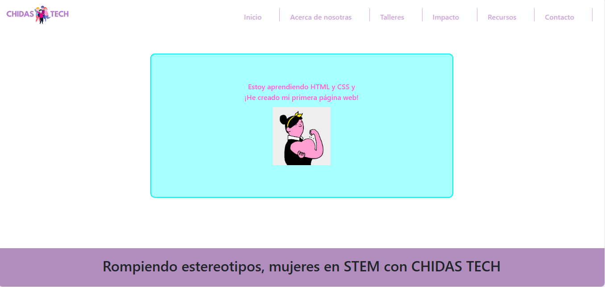
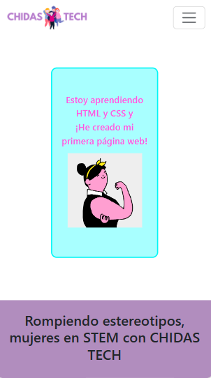

# CHIDAS TECH Clone

Este proyecto es un clon de la página web de CHIDAS TECH, creado como parte de mi aprendizaje en HTML y CSS utilizando Bootstrap.

## Descripción

La página web replica la estructura y diseño de CHIDAS TECH, una organización que promueve la participación de mujeres en STEM. Se ha utilizado Bootstrap para facilitar el diseño responsivo y garantizar una experiencia agradable tanto en dispositivos de escritorio como en dispositivos móviles.

 
 

  <h2>Vista Escritorio</h2>
  

 
 

  <h2>Vista Móvil</h2>
  

## Tecnologías Utilizadas

- HTML
- CSS
- [Bootstrap](https://getbootstrap.com/): Framework de desarrollo web para diseño responsivo.

[Enlace al Proyecto](https://proyecto2-chidas.vercel.app/) ✌️

  

